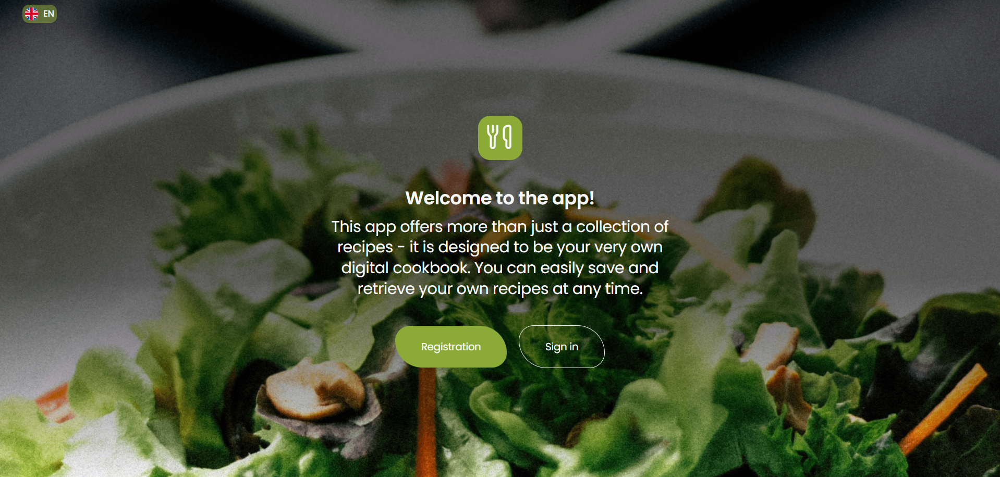
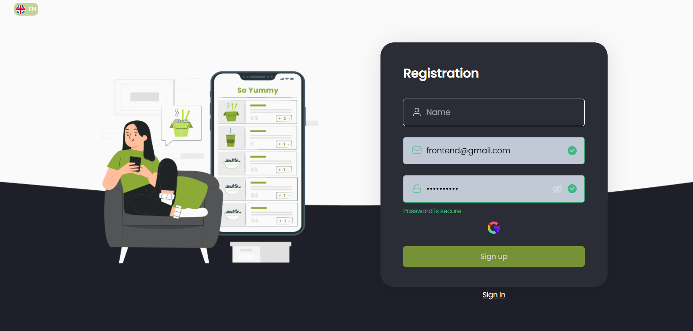
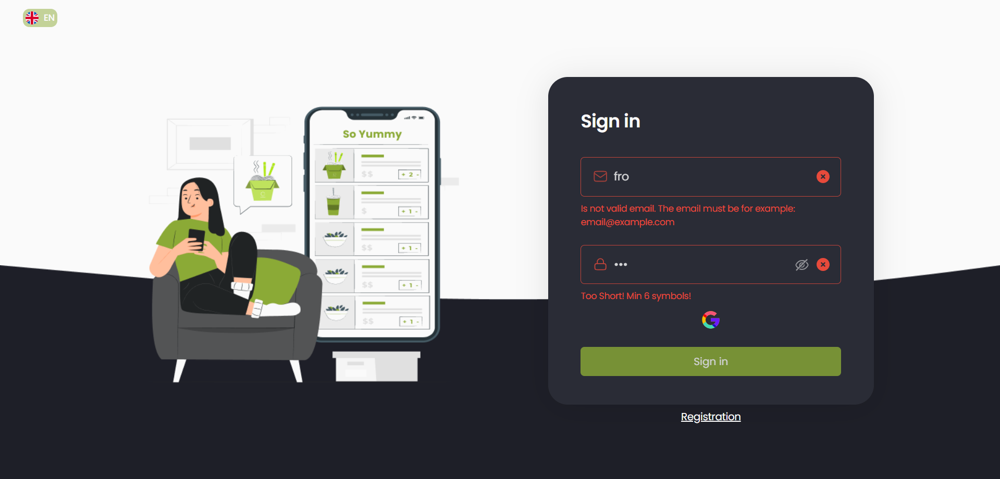
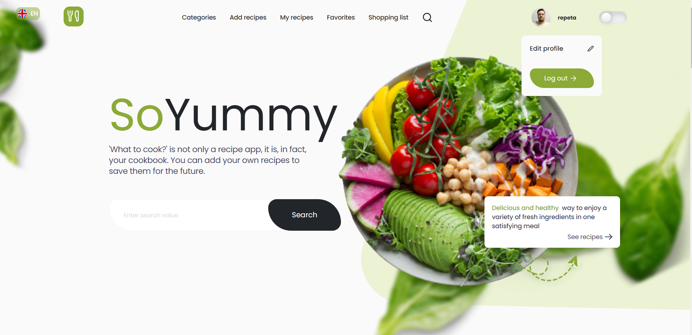
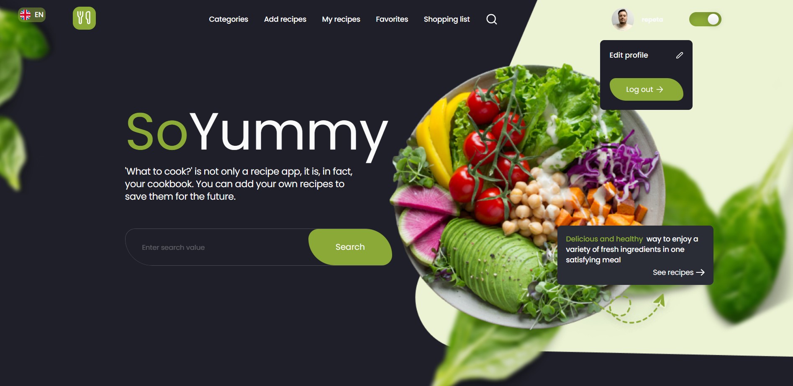
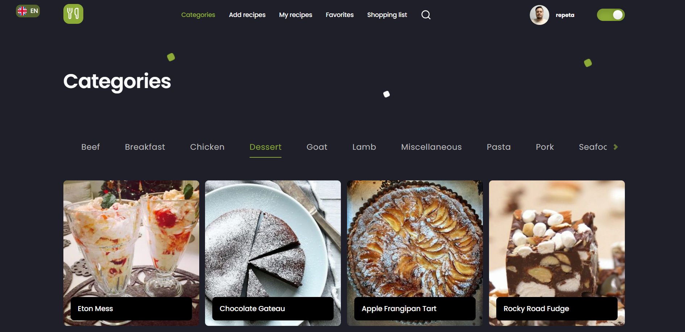
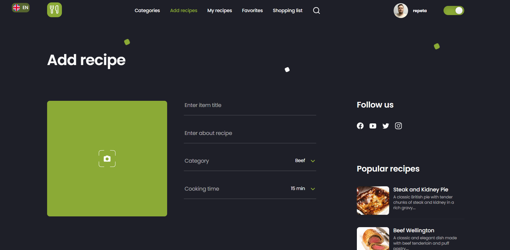
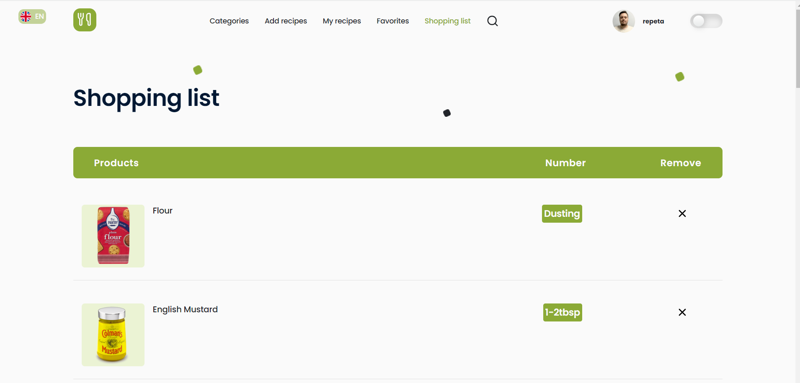

**Read in other languages: [English](README.md), [English](README.lg.md).**

# So-yummy - website for cooking

It's an application that will help you to find or compose the necessary recipes
for cooking. You can create your own recipes, save them, collect the necessary
ingredients to form a healthy way of eating.

## Team project with TypeScript

1. Bohdan Orlovskiy - Bohdan100.
2. Anna Lisitsyna - lisitsyna-anna.
3. Olha Zamlynska - olhazamlynska.
4. Mykola Zaikovskyi - mykola1982.

## Tech Stack

1. Frontend: TypeScript, React, Redux Toolkit, React Router, styled-components,
   axios, @mui/material, Formik, Yup, react-icons, react-toastify.
2. Adaptive layout for mobile, tablet and desktop.
3. Private and public routes, authorization.
4. Light/dark theme.

## Local launch of the program on your device

1. Download and install Node.js.
2. Download repository and install dependencies -> npm install
3. Launch the application -> npm start.

### Backend

1. For this frontend website team backend built on a Node.js, Express.js,
   jsonwebtoken, mongoose, multer etc.  
   [https://so-yummy-98ev.onrender.com](https://so-yummy-98ev.onrender.com).

### Pages photo

Welcome Page

Register Page with form validation

Login Page with form validation

Main Page - light theme

Main Page - dark theme

Categories Page - dark theme

Add Recipe Page - dark theme

Shopping List Page - light theme

